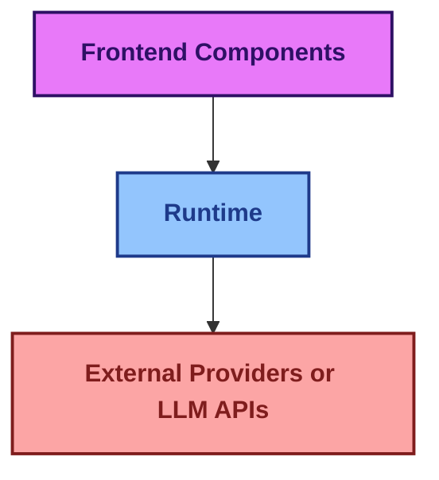
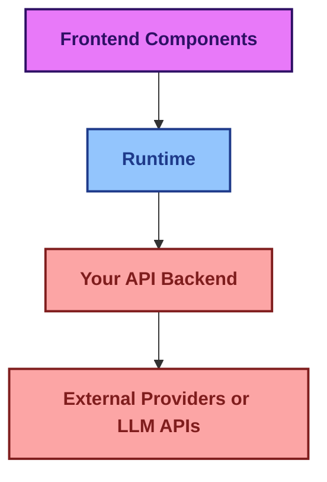
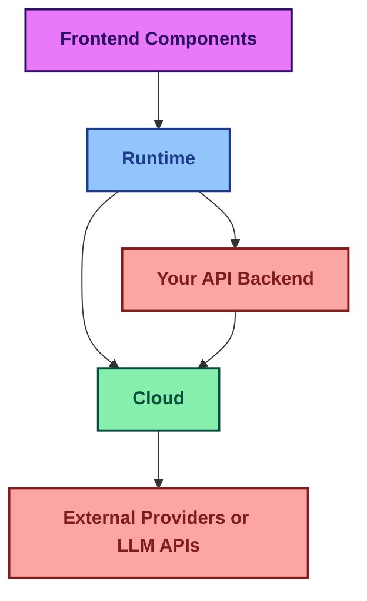

import { Sparkles, PanelsTopLeft, Database, Terminal } from "lucide-react";

## assistant-ui is built on these main pillars:

    <Card title='1. Frontend components'>
        Shadcn UI chat components with built-in state management
    </Card>

    <Card title='2. Runtime'>
        State management layer connecting UI to LLMs and backend services
    </Card>

    <Card title='3. Assistant Cloud'>
        Hosted service for thread persistence, history, and user management
    </Card>

### 1. Frontend components
Stylized and functional chat components built on top of Shadcn components that have context state management provided by the assistantUI runtime provider. These pre-built React components come with intelligent state management. [View our components](/docs/ui/Thread)

### 2. Runtime
A React state management context for assistant chat. The runtime handles data conversions between the local state and calls to backends and LLMs. We offer different runtime solutions that work with various frameworks like Vercel AI SDK, LangGraph, LangChain, Helicone, local runtime, and an ExternalStore when you need full control of the frontend message state. [You can view the runtimes we support](/docs/runtimes/pick-a-runtime)

### 3. Assistant Cloud
A hosted service that enhances your assistant experience with comprehensive thread management and message history. Assistant Cloud stores complete message history, automatically persists threads, supports human-in-the-loop workflows, and integrates with common auth providers to seamlessly allow users to resume conversations at any point. [Cloud Docs](/docs/cloud/overview)

### There are three common ways to architect your assistant-ui application:

#### **1. Direct Integration with External Providers**

#### **2. Using your own API endpoint**

#### **3. With Assistant Cloud**

