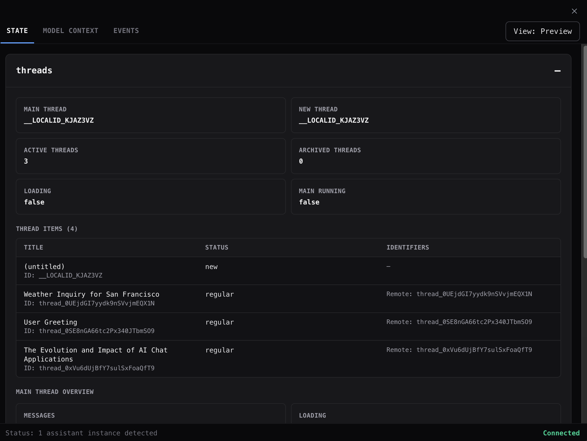

import { Step, Steps } from "fumadocs-ui/components/steps";
import { InstallCommand } from "@/components/docs/install-command";

Hey, the assistant-ui DevTools allows you to debug the assistant-ui state and context, and events without resorting to `console.log`. It's an easy way to see how data flows to the assistant-ui's runtime layer.



## Setup

<Steps>
  <Step>

### Install the DevTools package

<InstallCommand npm={["@assistant-ui/react-devtools"]} />

  </Step>
  <Step>

### Mount the DevTools modal

```tsx
import { AssistantRuntimeProvider } from "@assistant-ui/react";
import { DevToolsModal } from "@assistant-ui/react-devtools";

export function AssistantApp() {
  return (
    <AssistantRuntimeProvider>
      <DevToolsModal />
      {/* ...your assistant-ui... */}
    </AssistantRuntimeProvider>
  );
}
```

  </Step>
  <Step>

### Verify the DevTools overlay

That's it! In development builds you should now see the DevTools in the lower-right corner of your site.


  </Step>
</Steps>
