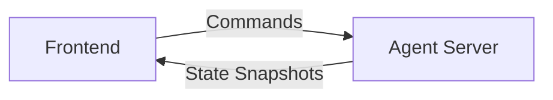
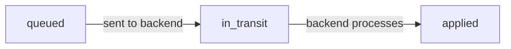
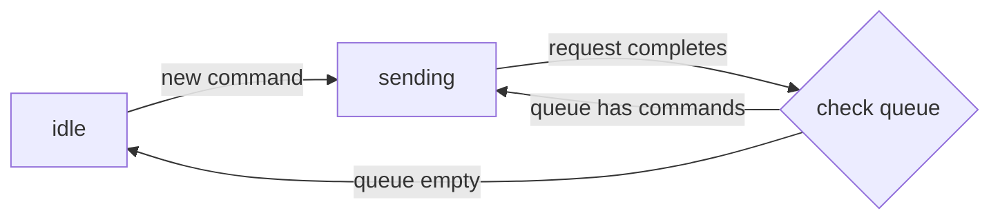

import { Callout } from "fumadocs-ui/components/callout";
import { Tab, Tabs } from "fumadocs-ui/components/tabs";

If you've built an agent as a Python or TypeScript script and want to add a UI to it, you need to solve two problems: streaming updates to the frontend and integrating with the UI framework. Assistant Transport handles both.

Assistant Transport streams your agent's complete state to the frontend in real-time. Unlike traditional approaches that only stream predefined message types (like text or tool calls), it streams your entire agent state—whatever structure your agent uses internally.

It consists of:

- **State streaming**: Efficiently streams updates to your agent state (supports any JSON object)
- **UI integration**: Converts your agent's state into assistant-ui components that render in the browser
- **Command handling**: Sends user actions (messages, tool executions, custom commands) back to your agent

## When to Use Assistant Transport

Use Assistant Transport when:

- You don't have a streaming protocol yet and need one
- You want your agent's native state to be directly accessible in the frontend
- You're building a custom agent framework or one without a streaming protocol (e.g. OSS LangGraph)

## Mental Model



The frontend receives state snapshots and converts them to React components. The goal is to have the UI be a stateless view on top of the agent framework state.

The agent server receives commands from the frontend. When a user interacts with the UI (sends a message, clicks a button, etc.), the frontend queues a command and sends it to the backend. Assistant Transport defines standard commands like `add-message` and `add-tool-result`, and you can define custom commands.

### Command Lifecycle

Commands go through the following lifecycle:



The runtime alternates between **idle** (no active backend request) and **sending** (request in flight). When a new command is created while idle, it's immediately sent. Otherwise, it's queued until the current request completes.



To implement this architecture, you need to build 2 pieces:

1. **Backend endpoint** on the agent server that accepts commands and returns a stream of state snapshots
2. **Frontend-side [state converter](#state-converter)** that converts state snapshots to assistant-ui's data format so that the UI primitives work

## Building a Backend Endpoint

Let's build the backend endpoint step by step. You'll need to handle incoming commands, update your agent state, and stream the updates back to the frontend.

The backend endpoint receives POST requests with the following payload:

```typescript
{
  state: T, // The previous state that the frontend has access to
  commands: AssistantTransportCommand[],
  system?: string,
  tools?: ToolDefinition[]
}
```

The backend endpoint returns a stream of state snapshots using the `assistant-stream` library ([npm](https://www.npmjs.com/package/assistant-stream) / [PyPI](https://pypi.org/project/assistant-stream/)).

### Handling Commands

The backend endpoint processes commands from the `commands` array:

```python
for command in request.commands:
    if command.type == "add-message":
        # Handle adding a user message
    elif command.type == "add-tool-result":
        # Handle tool execution result
    elif command.type == "my-custom-command":
        # Handle your custom command
```

### Streaming Updates

To stream state updates, modify `controller.state` within your run callback:

```python
from assistant_stream import RunController, create_run
from assistant_stream.serialization import DataStreamResponse

@app.post("/assistant")
async def chat_endpoint(request: ChatRequest):
    async def run_callback(controller: RunController):
        # Emits "set" at path ["message"] with value "Hello"
        controller.state["message"] = "Hello"

        # Emits "append-text" at path ["message"] with value " World"
        controller.state["message"] += " World"

    # Create and return the stream
    stream = create_run(run_callback, state=request.state)
    return DataStreamResponse(stream)
```

The state snapshots are automatically streamed to the frontend using the operations described in [Streaming Protocol](#streaming-protocol).

### Backend Reference Implementation

<Tabs items={["Minimal", "Example", "LangGraph"]}>
<Tab>

```python
from assistant_stream import RunController, create_run
from assistant_stream.serialization import DataStreamResponse

async def run_callback(controller: RunController):
    # Initialize state
    if controller.state is None:
        controller.state = {}

    # Process commands
    for command in request.commands:
        # Handle commands...

    # Run your agent and stream updates
    async for event in agent.stream():
        # update controller.state
        pass

# Create and return the stream
stream = create_run(run_callback, state=request.state)
return DataStreamResponse(stream)
```

</Tab>
<Tab>

```python
from assistant_stream.serialization import DataStreamResponse
from assistant_stream import RunController, create_run

@app.post("/assistant")
async def chat_endpoint(request: ChatRequest):
    """Chat endpoint with custom agent streaming."""

    async def run_callback(controller: RunController):
        # Initialize controller state
        if controller.state is None:
            controller.state = {"messages": []}

        # Process commands
        for command in request.commands:
            if command.type == "add-message":
                # Add message to messages array
                controller.state["messages"].append(command.message)

        # Run your custom agent and stream updates
        async for message in your_agent.stream():
            # Push message to messages array
            controller.state["messages"].append(message)

    # Create streaming response
    stream = create_run(run_callback, state=request.state)
    return DataStreamResponse(stream)
```

</Tab>
<Tab>

```python
from assistant_stream.serialization import DataStreamResponse
from assistant_stream import RunController, create_run
from assistant_stream.modules.langgraph import append_langgraph_event

@app.post("/assistant")
async def chat_endpoint(request: ChatRequest):
    """Chat endpoint using LangGraph with streaming."""

    async def run_callback(controller: RunController):
        # Initialize controller state
        if controller.state is None:
            controller.state = {}
        if "messages" not in controller.state:
            controller.state["messages"] = []

        input_messages = []

        # Process commands
        for command in request.commands:
            if command.type == "add-message":
                text_parts = [
                    part.text for part in command.message.parts
                    if part.type == "text" and part.text
                ]
                if text_parts:
                    input_messages.append(HumanMessage(content=" ".join(text_parts)))

        # Create initial state for LangGraph
        input_state = {"messages": input_messages}

        # Stream events from LangGraph
        async for namespace, event_type, chunk in graph.astream(
            input_state,
            stream_mode=["messages", "updates"],
            subgraphs=True
        ):
            append_langgraph_event(
                controller.state,
                namespace,
                event_type,
                chunk
            )

    # Create streaming response
    stream = create_run(run_callback, state=request.state)
    return DataStreamResponse(stream)
```

</Tab>
</Tabs>

Full example: [`python/assistant-transport-backend-langgraph`](https://github.com/assistant-ui/assistant-ui/tree/main/python/assistant-transport-backend-langgraph)

## Streaming Protocol

The assistant-stream state replication protocol allows for streaming updates to an arbitrary JSON object.

### Operations

The protocol supports two operations:

> **Note:** We've found that these two operations are enough to handle all sorts of complex state operations efficiently. `set` handles value updates and nested structures, while `append-text` enables efficient streaming of text content.

#### `set`

Sets a value at a specific path in the JSON object.

```json
// Operation
{ "type": "set", "path": ["status"], "value": "completed" }

// Before
{ "status": "pending" }

// After
{ "status": "completed" }
```

#### `append-text`

Appends text to an existing string value at a path.

```json
// Operation
{ "type": "append-text", "path": ["message"], "value": " World" }

// Before
{ "message": "Hello" }

// After
{ "message": "Hello World" }
```

### Wire Format

<Callout type="warn">
  The wire format will be migrated to Server-Sent Events (SSE) in a future
  release.
</Callout>

The wire format is inspired by [AI SDK's data stream protocol](https://sdk.vercel.ai/docs/ai-sdk-ui/stream-protocol).

**State Update:**

```
aui-state:ObjectStreamOperation[]
```

```
aui-state:[{"type":"set","path":["status"],"value":"completed"}]
```

**Error:**

```
3:string
```

```
3:"error message"
```

## Building a Frontend

Now let's set up the frontend. The state converter is the heart of the integration—it transforms your agent's state into the format assistant-ui expects.

The `useAssistantTransportRuntime` hook is used to configure the runtime. It accepts the following config:

```typescript
{
  initialState: T,
  api: string,
  resumeApi?: string,
  converter: (state: T, connectionMetadata: ConnectionMetadata) => AssistantTransportState,
  headers?: Record<string, string> | (() => Promise<Record<string, string>>),
  body?: object,
  onResponse?: (response: Response) => void,
  onFinish?: () => void,
  onError?: (error: Error) => void,
  onCancel?: () => void
}
```

### State Converter

The state converter is the core of your frontend integration. It transforms your agent's state into assistant-ui's message format.

```typescript
(
  state: T, // Your agent's state
  connectionMetadata: {
    pendingCommands: Command[], // Commands not yet sent to backend
    isSending: boolean // Whether a request is in flight
  }
) => {
  messages: ThreadMessage[], // Messages to display
  isRunning: boolean // Whether the agent is running
}
```

### Converting Messages

Use the `createMessageConverter` API to transform your agent's messages to assistant-ui format:

<Tabs items={["Example", "LangChain"]}>
<Tab>

```typescript
import { unstable_createMessageConverter as createMessageConverter } from "@assistant-ui/react";

// Define your message type
type YourMessageType = {
  id: string;
  role: "user" | "assistant";
  content: string;
  timestamp: number;
};

// Define a converter function for a single message
const exampleMessageConverter = (message: YourMessageType) => {
  // Transform a single message to assistant-ui format
  return {
    role: message.role,
    content: [{ type: "text", text: message.content }]
  };
};

const messageConverter = createMessageConverter(exampleMessageConverter);

const converter = (state: YourAgentState) => {
  return {
    messages: messageConverter.toThreadMessages(state.messages),
    isRunning: false
  };
};
```

</Tab>
<Tab>

```typescript
import { unstable_createMessageConverter as createMessageConverter } from "@assistant-ui/react";
import { convertLangChainMessages } from "@assistant-ui/react-langgraph";

const messageConverter = createMessageConverter(convertLangChainMessages);

const converter = (state: YourAgentState) => {
  return {
    messages: messageConverter.toThreadMessages(state.messages),
    isRunning: false
  };
};
```

</Tab>
</Tabs>

**Reverse mapping:**

The message converter allows you to retrieve the original message format anywhere inside assistant-ui. This lets you access your agent's native message structure from any assistant-ui component:

```typescript
// Get original message(s) from a ThreadMessage anywhere in assistant-ui
const originalMessage = messageConverter.toOriginalMessage(threadMessage);
```

### Optimistic Updates from Commands

The converter also receives `connectionMetadata` which contains pending commands. Use this to show optimistic updates:

```typescript
const converter = (state: State, connectionMetadata: ConnectionMetadata) => {
  // Extract pending messages from commands
  const optimisticMessages = connectionMetadata.pendingCommands
    .filter((c) => c.type === "add-message")
    .map((c) => c.message);

  return {
    messages: [...state.messages, ...optimisticMessages],
    isRunning: connectionMetadata.isSending || false
  };
};
```

## Handling Errors and Cancellations

The `onError` and `onCancel` callbacks receive an `updateState` function that allows you to update the agent state on the client side without making a server request:

```typescript
const runtime = useAssistantTransportRuntime({
  // ... other options
  onError: (error, { commands, updateState }) => {
    console.error("Error occurred:", error);
    console.log("Commands in transit:", commands);

    // Update state to reflect the error
    updateState((currentState) => ({
      ...currentState,
      lastError: error.message,
    }));
  },
  onCancel: ({ commands, updateState }) => {
    console.log("Request cancelled");
    console.log("Commands in transit or queued:", commands);

    // Update state to reflect cancellation
    updateState((currentState) => ({
      ...currentState,
      status: "cancelled",
    }));
  },
});
```

> **Note:** `onError` receives commands that were in transit, while `onCancel` receives both in-transit and queued commands.

## Custom Headers and Body

You can pass custom headers and body to the backend endpoint:

```typescript
const runtime = useAssistantTransportRuntime({
  // ... other options
  headers: {
    "Authorization": "Bearer token",
    "X-Custom-Header": "value",
  },
  body: {
    customField: "value",
  },
});
```

### Dynamic Headers and Body

You can also evaluate the header and body payloads on every request by passing an async function:

```typescript
const runtime = useAssistantTransportRuntime({
  // ... other options
  headers: async () => ({
    "Authorization": `Bearer ${await getAccessToken()}`,
    "X-Request-ID": crypto.randomUUID(),
  }),
  body: {
    customField: "value",
  },
});
```

## Resuming from a Sync Server

<Callout type="info">
  We provide a sync server currently only as part of the enterprise plan. Please
  contact us for more information.
</Callout>

To enable resumability, you need to:

1. Pass a `resumeApi` URL to `useAssistantTransportRuntime` that points to your sync server
2. Use the `unstable_resumeRun` API to resume a conversation

```typescript
import { useAssistantApi } from "@assistant-ui/react";

const runtime = useAssistantTransportRuntime({
  // ... other options
  api: "http://localhost:8010/assistant",
  resumeApi: "http://localhost:8010/resume", // Sync server endpoint
  // ... other options
});

// Typically called on thread switch or mount to check if sync server has anything to resume
const api = useAssistantApi();
api.thread().unstable_resumeRun({
  parentId: null, // Ignored (will be removed in a future version)
});
```

## Accessing Runtime State

Use the `useAssistantTransportState` hook to access the current agent state from any component:

```typescript
import { useAssistantTransportState } from "@assistant-ui/react";

function MyComponent() {
  const state = useAssistantTransportState();

  return <div>{JSON.stringify(state)}</div>;
}
```

You can also pass a selector function to extract specific values:

```typescript
function MyComponent() {
  const messages = useAssistantTransportState((state) => state.messages);

  return <div>Message count: {messages.length}</div>;
}
```

### Type Safety

Use module augmentation to add types for your agent state:

```typescript title="assistant.config.ts"
import "@assistant-ui/react";

declare module "@assistant-ui/react" {
  namespace Assistant {
    interface ExternalState {
      myState: {
        messages: Message[];
        customField: string;
      };
    }
  }
}
```

> **Note:** Place this file anywhere in your project (e.g., `src/assistant.config.ts` or at the project root). TypeScript will automatically pick up the type augmentation through module resolution—you don't need to import this file anywhere.

After adding the type augmentation, `useAssistantTransportState` will be fully typed:

```typescript
function MyComponent() {
  // TypeScript knows about your custom fields
  const customField = useAssistantTransportState((state) => state.customField);

  return <div>{customField}</div>;
}
```

### Accessing the Original Message

If you're using `createMessageConverter`, you can access the original message format from any assistant-ui component using the converter's `toOriginalMessage` method:

```typescript
import { unstable_createMessageConverter as createMessageConverter } from "@assistant-ui/react";
import { useMessage } from "@assistant-ui/react";

const messageConverter = createMessageConverter(yourMessageConverter);

function MyMessageComponent() {
  const message = useMessage();

  // Get the original message(s) from the converted ThreadMessage
  const originalMessage = messageConverter.toOriginalMessage(message);

  // Access your agent's native message structure
  return <div>{originalMessage.yourCustomField}</div>;
}
```

You can also use `toOriginalMessages` to get all original messages when a ThreadMessage was created from multiple source messages:

```typescript
const originalMessages = messageConverter.toOriginalMessages(message);
```

## Frontend Reference Implementation

<Tabs items={["Example", "LangGraph"]}>
<Tab>

```tsx
"use client";

import {
  AssistantRuntimeProvider,
  AssistantTransportConnectionMetadata,
  useAssistantTransportRuntime,
} from "@assistant-ui/react";

type State = {
  messages: Message[];
};

// Converter function: transforms agent state to assistant-ui format
const converter = (
  state: State,
  connectionMetadata: AssistantTransportConnectionMetadata,
) => {
  // Add optimistic updates for pending commands
  const optimisticMessages = connectionMetadata.pendingCommands
    .filter((c) => c.type === "add-message")
    .map((c) => c.message);

  return {
    messages: [...state.messages, ...optimisticMessages],
    isRunning: connectionMetadata.isSending || false,
  };
};

export function MyRuntimeProvider({ children }) {
  const runtime = useAssistantTransportRuntime({
    initialState: {
      messages: [],
    },
    api: "http://localhost:8010/assistant",
    converter,
    headers: async () => ({
      "Authorization": "Bearer token",
    }),
    body: {
      "custom-field": "custom-value",
    },
    onResponse: (response) => {
      console.log("Response received from server");
    },
    onFinish: () => {
      console.log("Conversation completed");
    },
    onError: (error, { commands, updateState }) => {
      console.error("Assistant transport error:", error);
      console.log("Commands in transit:", commands);
    },
    onCancel: ({ commands, updateState }) => {
      console.log("Request cancelled");
      console.log("Commands in transit or queued:", commands);
    },
  });

  return (
    <AssistantRuntimeProvider runtime={runtime}>
      {children}
    </AssistantRuntimeProvider>
  );
}
```

</Tab>
<Tab>

```tsx
"use client";

import {
  AssistantRuntimeProvider,
  AssistantTransportConnectionMetadata,
  unstable_createMessageConverter as createMessageConverter,
  useAssistantTransportRuntime,
} from "@assistant-ui/react";
import {
  convertLangChainMessages,
  LangChainMessage,
} from "@assistant-ui/react-langgraph";

type State = {
  messages: LangChainMessage[];
};

const LangChainMessageConverter = createMessageConverter(
  convertLangChainMessages,
);

// Converter function: transforms agent state to assistant-ui format
const converter = (
  state: State,
  connectionMetadata: AssistantTransportConnectionMetadata,
) => {
  // Add optimistic updates for pending commands
  const optimisticStateMessages = connectionMetadata.pendingCommands.map(
    (c): LangChainMessage[] => {
      if (c.type === "add-message") {
        return [
          {
            type: "human" as const,
            content: [
              {
                type: "text" as const,
                text: c.message.parts
                  .map((p) => (p.type === "text" ? p.text : ""))
                  .join("\n"),
              },
            ],
          },
        ];
      }
      return [];
    },
  );

  const messages = [...state.messages, ...optimisticStateMessages.flat()];

  return {
    messages: LangChainMessageConverter.toThreadMessages(messages),
    isRunning: connectionMetadata.isSending || false,
  };
};

export function MyRuntimeProvider({ children }) {
  const runtime = useAssistantTransportRuntime({
    initialState: {
      messages: [],
    },
    api: "http://localhost:8010/assistant",
    converter,
    headers: async () => ({
      "Authorization": "Bearer token",
    }),
    body: {
      "custom-field": "custom-value",
    },
    onResponse: (response) => {
      console.log("Response received from server");
    },
    onFinish: () => {
      console.log("Conversation completed");
    },
    onError: (error, { commands, updateState }) => {
      console.error("Assistant transport error:", error);
      console.log("Commands in transit:", commands);
    },
    onCancel: ({ commands, updateState }) => {
      console.log("Request cancelled");
      console.log("Commands in transit or queued:", commands);
    },
  });

  return (
    <AssistantRuntimeProvider runtime={runtime}>
      {children}
    </AssistantRuntimeProvider>
  );
}
```

</Tab>
</Tabs>

Full example: [`examples/with-assistant-transport`](https://github.com/assistant-ui/assistant-ui/tree/main/examples/with-assistant-transport)

## Custom Commands

### Defining Custom Commands

Use module augmentation to define a custom command:

```typescript title="assistant.config.ts"
import "@assistant-ui/react";

declare module "@assistant-ui/react" {
  namespace Assistant {
    interface Commands {
      myCustomCommand: {
        type: "my-custom-command";
        data: string;
      };
    }
  }
}
```

### Issuing Commands

Use the `useAssistantTransportSendCommand` hook to send custom commands:

```typescript
import { useAssistantTransportSendCommand } from "@assistant-ui/react";

function MyComponent() {
  const sendCommand = useAssistantTransportSendCommand();

  const handleClick = () => {
    sendCommand({
      type: "my-custom-command",
      data: "Hello, world!",
    });
  };

  return <button onClick={handleClick}>Send Custom Command</button>;
}
```

### Backend Integration

The backend receives custom commands in the `commands` array, just like built-in commands:

```python
for command in request.commands:
    if command.type == "add-message":
        # Handle add-message command
    elif command.type == "add-tool-result":
        # Handle add-tool-result command
    elif command.type == "my-custom-command":
        # Handle your custom command
        data = command.data
```

### Optimistic Updates

Update the [state converter](#state-converter) to optimistically handle the custom command:

```typescript
const converter = (state: State, connectionMetadata: ConnectionMetadata) => {
  // Filter custom commands from pending commands
  const customCommands = connectionMetadata.pendingCommands.filter(
    (c) => c.type === "my-custom-command"
  );

  // Apply optimistic updates based on custom commands
  const optimisticState = {
    ...state,
    customData: customCommands.map((c) => c.data),
  };

  return {
    messages: state.messages,
    state: optimisticState,
    isRunning: connectionMetadata.isSending || false,
  };
};
```

### Cancellation and Error Behavior

Custom commands follow the same lifecycle as built-in commands. You can update your `onError` and `onCancel` handlers to take custom commands into account:

```typescript
const runtime = useAssistantTransportRuntime({
  // ... other options
  onError: (error, { commands, updateState }) => {
    // Check if any custom commands were in transit
    const customCommands = commands.filter((c) => c.type === "my-custom-command");

    if (customCommands.length > 0) {
      // Handle custom command errors
      updateState((state) => ({
        ...state,
        customCommandFailed: true,
      }));
    }
  },
  onCancel: ({ commands, updateState }) => {
    // Check if any custom commands were queued or in transit
    const customCommands = commands.filter((c) => c.type === "my-custom-command");

    if (customCommands.length > 0) {
      // Handle custom command cancellation
      updateState((state) => ({
        ...state,
        customCommandCancelled: true,
      }));
    }
  },
});
```
