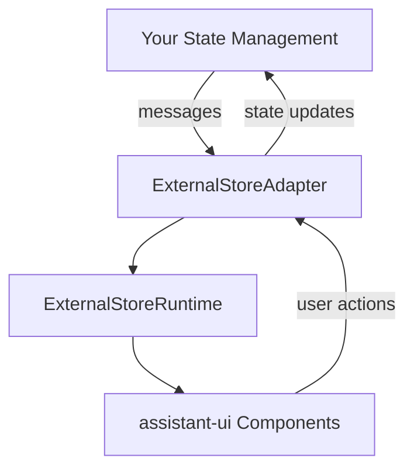

import { Callout } from "fumadocs-ui/components/callout";
import { Steps, Step } from "fumadocs-ui/components/steps";
import { Card, Cards } from "fumadocs-ui/components/card";
import { ParametersTable } from "@/components/docs";
import { InstallCommand } from "@/components/docs/install-command";

## Overview

`ExternalStoreRuntime` bridges your existing state management with assistant-ui components. It requires an `ExternalStoreAdapter<TMessage>` that handles communication between your state and the UI.

**Key differences from `LocalRuntime`:**

- **You own the state** - Full control over message state, thread management, and persistence logic
- **Bring your own state management** - Works with Redux, Zustand, TanStack Query, or any React state library
- **Custom message formats** - Use your backend's message structure with automatic conversion

<Callout type="warn">
  `ExternalStoreRuntime` gives you total control over state (persist, sync,
  share), but you must wire up every callback.
</Callout>

## Example Implementation

```tsx twoslash title="app/MyRuntimeProvider.tsx"
type MyMessage = {
  role: "user" | "assistant";
  content: string;
};
const backendApi = async (input: string): Promise<MyMessage> => {
  return { role: "assistant", content: "Hello, world!" };
};

// ---cut---
import { useState, ReactNode } from "react";
import {
  useExternalStoreRuntime,
  ThreadMessageLike,
  AppendMessage,
  AssistantRuntimeProvider,
} from "@assistant-ui/react";

const convertMessage = (message: MyMessage): ThreadMessageLike => {
  return {
    role: message.role,
    content: [{ type: "text", text: message.content }],
  };
};

export function MyRuntimeProvider({
  children,
}: Readonly<{
  children: ReactNode;
}>) {
  const [isRunning, setIsRunning] = useState(false);
  const [messages, setMessages] = useState<MyMessage[]>([]);

  const onNew = async (message: AppendMessage) => {
    if (message.content[0]?.type !== "text")
      throw new Error("Only text messages are supported");

    const input = message.content[0].text;
    setMessages((currentConversation) => [
      ...currentConversation,
      { role: "user", content: input },
    ]);

    setIsRunning(true);
    const assistantMessage = await backendApi(input);
    setMessages((currentConversation) => [
      ...currentConversation,
      assistantMessage,
    ]);
    setIsRunning(false);
  };

  const runtime = useExternalStoreRuntime({
    isRunning,
    messages,
    convertMessage,
    onNew,
  });

  return (
    <AssistantRuntimeProvider runtime={runtime}>
      {children}
    </AssistantRuntimeProvider>
  );
}
```

## When to Use

Use `ExternalStoreRuntime` if you need:

- **Full control over message state** - Manage messages with Redux, Zustand, TanStack Query, or any React state management library
- **Custom multi-thread implementation** - Build your own thread management system with custom storage
- **Integration with existing state** - Keep chat state in your existing state management solution
- **Custom message formats** - Use your backend's message structure with automatic conversion
- **Complex synchronization** - Sync messages with external data sources, databases, or multiple clients
- **Custom persistence logic** - Implement your own storage patterns and caching strategies

## Key Features

<Cards>
  <Card
    title="State Management Integration"
    description="Works seamlessly with Redux, Zustand, TanStack Query, and more"
  />
  <Card
    title="Message Conversion"
    description="Automatic conversion between your message format and assistant-ui's format"
  />
  <Card
    title="Real-time Streaming"
    description="Built-in support for streaming responses and progressive updates"
  />
  <Card
    title="Thread Management"
    description="Multi-conversation support with archiving and thread switching"
  />
</Cards>

## Architecture

### How It Works

`ExternalStoreRuntime` acts as a bridge between your state management and assistant-ui:



### Key Concepts

1. **State Ownership** - You own and control all message state
2. **Adapter Pattern** - The adapter translates between your state and assistant-ui
3. **Capability-Based Features** - UI features are enabled based on which handlers you provide
4. **Message Conversion** - Automatic conversion between your message format and assistant-ui's format
5. **Optimistic Updates** - Built-in handling for streaming and loading states

## Getting Started

<Steps>
  <Step>
    ### Install Dependencies

    <InstallCommand npm={["@assistant-ui/react"]} />

  </Step>
  
  <Step>
    ### Create Runtime Provider

    ```tsx title="app/MyRuntimeProvider.tsx"
    "use client";

    import { ThreadMessageLike } from "@assistant-ui/react";
    import { AppendMessage } from "@assistant-ui/react";
    import {
      AssistantRuntimeProvider,
      useExternalStoreRuntime,
    } from "@assistant-ui/react";
    import { useState } from "react";
    
    const convertMessage = (message: ThreadMessageLike) => {
      return message;
    };
    
    export function MyRuntimeProvider({
      children,
    }: Readonly<{
      children: React.ReactNode;
    }>) {
      const [messages, setMessages] = useState<readonly ThreadMessageLike[]>([]);
    
      const onNew = async (message: AppendMessage) => {
        if (message.content.length !== 1 || message.content[0]?.type !== "text")
          throw new Error("Only text content is supported");
    
        const userMessage: ThreadMessageLike = {
          role: "user",
          content: [{ type: "text", text: message.content[0].text }],
        };
        setMessages((currentMessages) => [...currentMessages, userMessage]);
    
        // normally you would perform an API call here to get the assistant response
        await new Promise((resolve) => setTimeout(resolve, 1000));
    
        const assistantMessage: ThreadMessageLike = {
          role: "assistant",
          content: [{ type: "text", text: "Hello, world!" }],
        };
        setMessages((currentMessages) => [...currentMessages, assistantMessage]);
      };
    
      const runtime = useExternalStoreRuntime<ThreadMessageLike>({
        messages,
        setMessages,
        onNew,
        convertMessage,
      });
    
      return (
        <AssistantRuntimeProvider runtime={runtime}>
          {children}
        </AssistantRuntimeProvider>
      );
    }
    ```

  </Step>

  <Step>
    ### Use in Your App

    ```tsx title="app/page.tsx"
    import { Thread } from "@assistant-ui/react";
    import { MyRuntimeProvider } from "./MyRuntimeProvider";

    export default function Page() {
      return (
        <MyRuntimeProvider>
          <Thread />
        </MyRuntimeProvider>
      );
    }
    ```

  </Step>
</Steps>

## Implementation Patterns

### Message Conversion

Two approaches for converting your message format:

#### 1. Simple Conversion (Recommended)

```tsx
const convertMessage = (message: MyMessage): ThreadMessageLike => ({
  role: message.role,
  content: [{ type: "text", text: message.text }],
  id: message.id,
  createdAt: new Date(message.timestamp),
});

const runtime = useExternalStoreRuntime({
  messages: myMessages,
  convertMessage,
  onNew,
});
```

#### 2. Advanced Conversion with `useExternalMessageConverter`

For complex scenarios with performance optimization:

```tsx
import { useExternalMessageConverter } from "@assistant-ui/react";

const convertedMessages = useExternalMessageConverter({
  messages,
  convertMessage: (message: MyMessage): ThreadMessageLike => ({
    role: message.role,
    content: [{ type: "text", text: message.text }],
    id: message.id,
    createdAt: new Date(message.timestamp),
  }),
  joinStrategy: "concat-content", // Merge adjacent assistant messages
});

const runtime = useExternalStoreRuntime({
  messages: convertedMessages,
  onNew,
  // No convertMessage needed - already converted
});
```

### Join Strategy

Controls how adjacent assistant messages are combined:

- **`concat-content`** (default): Merges adjacent assistant messages into one
- **`none`**: Keeps all messages separate

This is useful when your backend sends multiple message chunks that should appear as a single message in the UI.

<Callout type="info">
  `useExternalMessageConverter` provides performance optimization for complex
  message conversion scenarios. For simpler cases, consider using the basic
  `convertMessage` approach shown above.
</Callout>

### Essential Handlers

#### Basic Chat (onNew only)

```tsx
const runtime = useExternalStoreRuntime({
  messages,
  onNew: async (message) => {
    // Add user message to state
    const userMsg = { role: "user", content: message.content };
    setMessages([...messages, userMsg]);

    // Get AI response
    const response = await callAI(message);
    setMessages([...messages, userMsg, response]);
  },
});
```

#### Full-Featured Chat

```tsx
const runtime = useExternalStoreRuntime({
  messages,
  setMessages, // Enables branch switching
  onNew, // Required
  onEdit, // Enables message editing
  onReload, // Enables regeneration
  onCancel, // Enables cancellation
});
```

<Callout type="info">
  Each handler you provide enables specific UI features: - `setMessages` →
  Branch switching - `onEdit` → Message editing - `onReload` → Regenerate button
  - `onCancel` → Cancel button during generation
</Callout>

### Streaming Responses

Implement real-time streaming with progressive updates:

```tsx
const onNew = async (message: AppendMessage) => {
  // Add user message
  const userMessage: ThreadMessageLike = {
    role: "user",
    content: message.content,
    id: generateId(),
  };
  setMessages((prev) => [...prev, userMessage]);

  // Create placeholder for assistant message
  setIsRunning(true);
  const assistantId = generateId();
  const assistantMessage: ThreadMessageLike = {
    role: "assistant",
    content: [{ type: "text", text: "" }],
    id: assistantId,
  };
  setMessages((prev) => [...prev, assistantMessage]);

  // Stream response
  const stream = await api.streamChat(message);
  for await (const chunk of stream) {
    setMessages((prev) =>
      prev.map((m) =>
        m.id === assistantId
          ? {
              ...m,
              content: [
                {
                  type: "text",
                  text: (m.content[0] as any).text + chunk,
                },
              ],
            }
          : m,
      ),
    );
  }
  setIsRunning(false);
};
```

### Message Editing

Enable message editing by implementing the `onEdit` handler:

<Callout type="info">
  You can also implement `onEdit(editedMessage)` and `onRemove(messageId)`
  callbacks to handle user-initiated edits or deletions in your external store.
  This enables features like "edit and re-run" on your backend.
</Callout>

```tsx
const onEdit = async (message: AppendMessage) => {
  // Find the index where to insert the edited message
  const index = messages.findIndex((m) => m.id === message.parentId) + 1;

  // Keep messages up to the parent
  const newMessages = [...messages.slice(0, index)];

  // Add the edited message
  const editedMessage: ThreadMessageLike = {
    role: "user",
    content: message.content,
    id: message.id || generateId(),
  };
  newMessages.push(editedMessage);

  setMessages(newMessages);

  // Generate new response
  setIsRunning(true);
  const response = await api.chat(message);
  newMessages.push({
    role: "assistant",
    content: response.content,
    id: generateId(),
  });
  setMessages(newMessages);
  setIsRunning(false);
};
```

### Tool Calling

Support tool calls with proper result handling:

```tsx
const onAddToolResult = (options: AddToolResultOptions) => {
  setMessages((prev) =>
    prev.map((message) => {
      if (message.id === options.messageId) {
        // Update the specific tool call with its result
        return {
          ...message,
          content: message.content.map((part) => {
            if (
              part.type === "tool-call" &&
              part.toolCallId === options.toolCallId
            ) {
              return {
                ...part,
                result: options.result,
              };
            }
            return part;
          }),
        };
      }
      return message;
    }),
  );
};

const runtime = useExternalStoreRuntime({
  messages,
  onNew,
  onAddToolResult,
  // ... other props
});
```

#### Automatic Tool Result Matching

The runtime automatically matches tool results with their corresponding tool calls. When messages are converted and joined:

1. **Tool Call Tracking** - The runtime tracks tool calls by their `toolCallId`
2. **Result Association** - Tool results are automatically associated with their corresponding calls
3. **Message Grouping** - Related tool messages are intelligently grouped together

```tsx
// Example: Tool call and result in separate messages
const messages = [
  {
    role: "assistant",
    content: [
      {
        type: "tool-call",
        toolCallId: "call_123",
        toolName: "get_weather",
        args: { location: "San Francisco" },
      },
    ],
  },
  {
    role: "tool",
    content: [
      {
        type: "tool-result",
        toolCallId: "call_123",
        result: { temperature: 72, condition: "sunny" },
      },
    ],
  },
];

// These are automatically matched and grouped by the runtime
```

### File Attachments

Enable file uploads with the attachment adapter:

```tsx
const attachmentAdapter: AttachmentAdapter = {
  accept: "image/*,application/pdf,.txt,.md",
  async add(file) {
    // Upload file to your server
    const formData = new FormData();
    formData.append("file", file);

    const response = await fetch("/api/upload", {
      method: "POST",
      body: formData,
    });

    const { id, url } = await response.json();
    return {
      id,
      type: "document",
      name: file.name,
      file,
      url,
    };
  },
  async remove(attachment) {
    // Remove file from server
    await fetch(`/api/upload/${attachment.id}`, {
      method: "DELETE",
    });
  },
};

const runtime = useExternalStoreRuntime({
  messages,
  onNew,
  adapters: {
    attachments: attachmentAdapter,
  },
});
```

### Thread Management

#### Managing Thread Context

When implementing multi-thread support with `ExternalStoreRuntime`, you need to carefully manage thread context across your application. Here's a comprehensive approach:

```tsx
// Create a context for thread management
const ThreadContext = createContext<{
  currentThreadId: string;
  setCurrentThreadId: (id: string) => void;
  threads: Map<string, ThreadMessageLike[]>;
  setThreads: React.Dispatch<
    React.SetStateAction<Map<string, ThreadMessageLike[]>>
  >;
}>({
  currentThreadId: "default",
  setCurrentThreadId: () => {},
  threads: new Map(),
  setThreads: () => {},
});

// Thread provider component
export function ThreadProvider({ children }: { children: ReactNode }) {
  const [threads, setThreads] = useState<Map<string, ThreadMessageLike[]>>(
    new Map([["default", []]]),
  );
  const [currentThreadId, setCurrentThreadId] = useState("default");

  return (
    <ThreadContext.Provider
      value={{ currentThreadId, setCurrentThreadId, threads, setThreads }}
    >
      {children}
    </ThreadContext.Provider>
  );
}

// Hook for accessing thread context
export function useThreadContext() {
  const context = useContext(ThreadContext);
  if (!context) {
    throw new Error("useThreadContext must be used within ThreadProvider");
  }
  return context;
}
```

#### Complete Thread Implementation

Here's a full implementation with proper context management:

```tsx
function ChatWithThreads() {
  const { currentThreadId, setCurrentThreadId, threads, setThreads } =
    useThreadContext();
  const [threadList, setThreadList] = useState<ExternalStoreThreadData[]>([
    { threadId: "default", status: "regular", title: "New Chat" },
  ]);

  // Get messages for current thread
  const currentMessages = threads.get(currentThreadId) || [];

  const threadListAdapter: ExternalStoreThreadListAdapter = {
    threadId: currentThreadId,
    threads: threadList.filter((t) => t.status === "regular"),
    archivedThreads: threadList.filter((t) => t.status === "archived"),

    onSwitchToNewThread: () => {
      const newId = `thread-${Date.now()}`;
      setThreadList((prev) => [
        ...prev,
        {
          threadId: newId,
          status: "regular",
          title: "New Chat",
        },
      ]);
      setThreads((prev) => new Map(prev).set(newId, []));
      setCurrentThreadId(newId);
    },

    onSwitchToThread: (threadId) => {
      setCurrentThreadId(threadId);
    },

    onRename: (threadId, newTitle) => {
      setThreadList((prev) =>
        prev.map((t) =>
          t.threadId === threadId ? { ...t, title: newTitle } : t,
        ),
      );
    },

    onArchive: (threadId) => {
      setThreadList((prev) =>
        prev.map((t) =>
          t.threadId === threadId ? { ...t, status: "archived" } : t,
        ),
      );
    },

    onDelete: (threadId) => {
      setThreadList((prev) => prev.filter((t) => t.threadId !== threadId));
      setThreads((prev) => {
        const next = new Map(prev);
        next.delete(threadId);
        return next;
      });
      if (currentThreadId === threadId) {
        setCurrentThreadId("default");
      }
    },
  };

  const runtime = useExternalStoreRuntime({
    messages: currentMessages,
    setMessages: (messages) => {
      setThreads((prev) => new Map(prev).set(currentThreadId, messages));
    },
    onNew: async (message) => {
      // Handle new message for current thread
      // Your implementation here
    },
    adapters: {
      threadList: threadListAdapter,
    },
  });

  return (
    <AssistantRuntimeProvider runtime={runtime}>
      <ThreadList />
      <Thread />
    </AssistantRuntimeProvider>
  );
}

// App component with proper context wrapping
export function App() {
  return (
    <ThreadProvider>
      <ChatWithThreads />
    </ThreadProvider>
  );
}
```

#### Thread Context Best Practices

<Callout type="info">
  **Critical**: When using `ExternalStoreRuntime` with threads, the
  `currentThreadId` must be consistent across all components and handlers.
  Mismatched thread IDs will cause messages to appear in wrong threads or
  disappear entirely.
</Callout>

1. **Centralize Thread State**: Always use a context or global state management solution to ensure thread ID consistency:

```tsx
// ❌ Bad: Local state in multiple components
function ThreadList() {
  const [currentThreadId, setCurrentThreadId] = useState("default");
  // This won't sync with the runtime!
}

// ✅ Good: Shared context
function ThreadList() {
  const { currentThreadId, setCurrentThreadId } = useThreadContext();
  // Thread ID is synchronized everywhere
}
```

2. **Sync Thread Changes**: Ensure all thread-related operations update both the thread ID and messages:

```tsx
// ❌ Bad: Only updating thread ID
onSwitchToThread: (threadId) => {
  setCurrentThreadId(threadId);
  // Messages won't update!
};

// ✅ Good: Complete state update
onSwitchToThread: (threadId) => {
  setCurrentThreadId(threadId);
  // Messages automatically update via currentMessages = threads.get(currentThreadId)
};
```

3. **Handle Edge Cases**: Always provide fallbacks for missing threads:

```tsx
// Ensure thread always exists
const currentMessages = threads.get(currentThreadId) || [];

// Initialize new threads properly
const initializeThread = (threadId: string) => {
  if (!threads.has(threadId)) {
    setThreads((prev) => new Map(prev).set(threadId, []));
  }
};
```

4. **Persist Thread State**: For production apps, sync thread state with your backend:

```tsx
// Save thread state to backend
useEffect(() => {
  const saveThread = async () => {
    await api.saveThread(currentThreadId, threads.get(currentThreadId) || []);
  };

  const debounced = debounce(saveThread, 1000);
  debounced();

  return () => debounced.cancel();
}, [currentThreadId, threads]);
```

## Integration Examples

### Redux Integration

```tsx title="app/chatSlice.ts"
// Using Redux Toolkit (recommended)
import { createSlice, PayloadAction } from "@reduxjs/toolkit";
import { ThreadMessageLike } from "@assistant-ui/react";

interface ChatState {
  messages: ThreadMessageLike[];
  isRunning: boolean;
}

const chatSlice = createSlice({
  name: "chat",
  initialState: {
    messages: [] as ThreadMessageLike[],
    isRunning: false,
  },
  reducers: {
    setMessages: (state, action: PayloadAction<ThreadMessageLike[]>) => {
      state.messages = action.payload;
    },
    addMessage: (state, action: PayloadAction<ThreadMessageLike>) => {
      state.messages.push(action.payload);
    },
    setIsRunning: (state, action: PayloadAction<boolean>) => {
      state.isRunning = action.payload;
    },
  },
});

export const { setMessages, addMessage, setIsRunning } = chatSlice.actions;
export const selectMessages = (state: RootState) => state.chat.messages;
export const selectIsRunning = (state: RootState) => state.chat.isRunning;
export default chatSlice.reducer;

// ReduxRuntimeProvider.tsx
import { useSelector, useDispatch } from "react-redux";
import {
  selectMessages,
  selectIsRunning,
  addMessage,
  setMessages,
  setIsRunning,
} from "./chatSlice";

export function ReduxRuntimeProvider({ children }) {
  const messages = useSelector(selectMessages);
  const isRunning = useSelector(selectIsRunning);
  const dispatch = useDispatch();

  const runtime = useExternalStoreRuntime({
    messages,
    isRunning,
    setMessages: (messages) => dispatch(setMessages(messages)),
    onNew: async (message) => {
      // Add user message
      dispatch(
        addMessage({
          role: "user",
          content: message.content,
          id: `msg-${Date.now()}`,
          createdAt: new Date(),
        }),
      );

      // Generate response
      dispatch(setIsRunning(true));
      const response = await api.chat(message);
      dispatch(
        addMessage({
          role: "assistant",
          content: response.content,
          id: `msg-${Date.now()}`,
          createdAt: new Date(),
        }),
      );
      dispatch(setIsRunning(false));
    },
  });

  return (
    <AssistantRuntimeProvider runtime={runtime}>
      {children}
    </AssistantRuntimeProvider>
  );
}
```

### Zustand Integration (v5)

```tsx title="app/chatStore.ts"
// Using Zustand v5 with TypeScript
import { create } from "zustand";
import { immer } from "zustand/middleware/immer";
import { ThreadMessageLike } from "@assistant-ui/react";

interface ChatState {
  messages: ThreadMessageLike[];
  isRunning: boolean;
  addMessage: (message: ThreadMessageLike) => void;
  setMessages: (messages: ThreadMessageLike[]) => void;
  setIsRunning: (isRunning: boolean) => void;
  updateMessage: (id: string, updates: Partial<ThreadMessageLike>) => void;
}

// Zustand v5 requires the extra parentheses for TypeScript
const useChatStore = create<ChatState>()(
  immer((set) => ({
    messages: [],
    isRunning: false,

    addMessage: (message) =>
      set((state) => {
        state.messages.push(message);
      }),

    setMessages: (messages) =>
      set((state) => {
        state.messages = messages;
      }),

    setIsRunning: (isRunning) =>
      set((state) => {
        state.isRunning = isRunning;
      }),

    updateMessage: (id, updates) =>
      set((state) => {
        const index = state.messages.findIndex((m) => m.id === id);
        if (index !== -1) {
          Object.assign(state.messages[index], updates);
        }
      }),
  })),
);

// ZustandRuntimeProvider.tsx
import { useShallow } from "zustand/shallow";

export function ZustandRuntimeProvider({ children }) {
  // Use useShallow to prevent unnecessary re-renders
  const { messages, isRunning, addMessage, setMessages, setIsRunning } =
    useChatStore(
      useShallow((state) => ({
        messages: state.messages,
        isRunning: state.isRunning,
        addMessage: state.addMessage,
        setMessages: state.setMessages,
        setIsRunning: state.setIsRunning,
      })),
    );

  const runtime = useExternalStoreRuntime({
    messages,
    isRunning,
    setMessages,
    onNew: async (message) => {
      // Add user message
      addMessage({
        role: "user",
        content: message.content,
        id: `msg-${Date.now()}`,
        createdAt: new Date(),
      });

      // Generate response
      setIsRunning(true);
      const response = await api.chat(message);
      addMessage({
        role: "assistant",
        content: response.content,
        id: `msg-${Date.now()}-assistant`,
        createdAt: new Date(),
      });
      setIsRunning(false);
    },
  });

  return (
    <AssistantRuntimeProvider runtime={runtime}>
      {children}
    </AssistantRuntimeProvider>
  );
}
```

### TanStack Query Integration

```tsx title="app/chatQueries.ts"
// Using TanStack Query v5 with TypeScript
import { useQuery, useMutation, useQueryClient } from "@tanstack/react-query";
import { ThreadMessageLike, AppendMessage } from "@assistant-ui/react";

// Query key factory pattern
export const messageKeys = {
  all: ["messages"] as const,
  thread: (threadId: string) => [...messageKeys.all, threadId] as const,
};

// TanStackQueryRuntimeProvider.tsx
export function TanStackQueryRuntimeProvider({ children }) {
  const queryClient = useQueryClient();
  const threadId = "main"; // Or from context/props

  const { data: messages = [] } = useQuery({
    queryKey: messageKeys.thread(threadId),
    queryFn: () => fetchMessages(threadId),
    staleTime: 1000 * 60 * 5, // Consider data fresh for 5 minutes
  });

  const sendMessage = useMutation({
    mutationFn: api.chat,

    // Optimistic updates with proper TypeScript types
    onMutate: async (message: AppendMessage) => {
      // Cancel any outgoing refetches
      await queryClient.cancelQueries({
        queryKey: messageKeys.thread(threadId),
      });

      // Snapshot the previous value
      const previousMessages = queryClient.getQueryData<ThreadMessageLike[]>(
        messageKeys.thread(threadId),
      );

      // Optimistically update with typed data
      const optimisticMessage: ThreadMessageLike = {
        role: "user",
        content: message.content,
        id: `temp-${Date.now()}`,
        createdAt: new Date(),
      };

      queryClient.setQueryData<ThreadMessageLike[]>(
        messageKeys.thread(threadId),
        (old = []) => [...old, optimisticMessage],
      );

      return { previousMessages, tempId: optimisticMessage.id };
    },

    onSuccess: (response, variables, context) => {
      // Replace optimistic message with real data
      queryClient.setQueryData<ThreadMessageLike[]>(
        messageKeys.thread(threadId),
        (old = []) => {
          // Remove temp message and add real ones
          return old
            .filter((m) => m.id !== context?.tempId)
            .concat([
              {
                role: "user",
                content: variables.content,
                id: `user-${Date.now()}`,
                createdAt: new Date(),
              },
              response,
            ]);
        },
      );
    },

    onError: (error, variables, context) => {
      // Rollback to previous messages on error
      if (context?.previousMessages) {
        queryClient.setQueryData(
          messageKeys.thread(threadId),
          context.previousMessages,
        );
      }
    },

    onSettled: () => {
      // Always refetch after error or success
      queryClient.invalidateQueries({
        queryKey: messageKeys.thread(threadId),
      });
    },
  });

  const runtime = useExternalStoreRuntime({
    messages,
    isRunning: sendMessage.isPending,
    onNew: async (message) => {
      await sendMessage.mutateAsync(message);
    },
    // Enable message editing
    setMessages: (newMessages) => {
      queryClient.setQueryData(messageKeys.thread(threadId), newMessages);
    },
  });

  return (
    <AssistantRuntimeProvider runtime={runtime}>
      {children}
    </AssistantRuntimeProvider>
  );
}
```

## Key Features

### Automatic Optimistic Updates

When `isRunning` becomes true, the runtime automatically shows an optimistic assistant message:

```tsx
// Your code
setIsRunning(true);

// Runtime automatically:
// 1. Shows empty assistant message with "in_progress" status
// 2. Displays typing indicator
// 3. Updates status to "complete" when isRunning becomes false
```

### Message Status Management

Assistant messages get automatic status updates:

- `"in_progress"` - When `isRunning` is true
- `"complete"` - When `isRunning` becomes false
- `"cancelled"` - When cancelled via `onCancel`

### Tool Result Matching

The runtime automatically matches tool results with their calls:

```tsx
// Tool call and result can be in separate messages
const messages = [
  {
    role: "assistant",
    content: [
      {
        type: "tool-call",
        toolCallId: "call_123",
        toolName: "get_weather",
        args: { location: "SF" },
      },
    ],
  },
  {
    role: "tool",
    content: [
      {
        type: "tool-result",
        toolCallId: "call_123",
        result: { temp: 72 },
      },
    ],
  },
];
// Runtime automatically associates these
```

## Working with External Messages

### Converting Back to Your Format

Use `getExternalStoreMessages` to access your original messages:

```tsx
import { getExternalStoreMessages } from "@assistant-ui/react";

const MyComponent = () => {
  const originalMessages = useMessage((m) => getExternalStoreMessages(m));
  // originalMessages is MyMessage[] (your original type)
};
```

<Callout type="info">
  After the chat finishes, use `getExternalStoreMessages(runtime)` to convert
  back to your domain model. Refer to the API reference for return structures
  and edge-case behaviors.
</Callout>

<Callout type="warning">
  `getExternalStoreMessages` may return multiple messages for a single UI
  message. This happens because assistant-ui merges adjacent assistant and tool
  messages for display.
</Callout>

### Message part Access

```tsx
const ToolUI = makeAssistantToolUI({
  render: () => {
    const originalMessages = useMessagePart((p) => getExternalStoreMessages(p));
    // Access original message data for this message part
  },
});
```

## Debugging

### Common Debugging Scenarios

```tsx
// Debug message conversion
const convertMessage = (message: MyMessage): ThreadMessageLike => {
  console.log("Converting message:", message);
  const converted = {
    role: message.role,
    content: [{ type: "text", text: message.content }],
  };
  console.log("Converted to:", converted);
  return converted;
};

// Debug adapter calls
const onNew = async (message: AppendMessage) => {
  console.log("onNew called with:", message);
  // ... implementation
};

// Enable verbose logging
const runtime = useExternalStoreRuntime({
  messages,
  onNew: (...args) => {
    console.log("Runtime onNew:", args);
    return onNew(...args);
  },
  // ... other props
});
```

## Best Practices

### 1. Immutable Updates

Always create new arrays when updating messages:

```tsx
// ❌ Wrong - mutating array
messages.push(newMessage);
setMessages(messages);

// ✅ Correct - new array
setMessages([...messages, newMessage]);
```

### 2. Stable Handler References

Memoize handlers to prevent runtime recreation:

```tsx
const onNew = useCallback(
  async (message: AppendMessage) => {
    // Handle new message
  },
  [
    /* dependencies */
  ],
);

const runtime = useExternalStoreRuntime({
  messages,
  onNew, // Stable reference
});
```

### 3. Performance Optimization

```tsx
// For large message lists
const recentMessages = useMemo(
  () => messages.slice(-50), // Show last 50 messages
  [messages],
);

// For expensive conversions
const convertMessage = useCallback((msg) => {
  // Conversion logic
}, []);
```

## `LocalRuntime` vs `ExternalStoreRuntime`

### When to Choose Which

| Scenario                         | Recommendation                                               |
| -------------------------------- | ------------------------------------------------------------ |
| Quick prototype                  | `LocalRuntime`                                               |
| Using Redux/Zustand              | `ExternalStoreRuntime`                                       |
| Need Assistant Cloud integration | `LocalRuntime`                                               |
| Custom thread storage            | Both (`LocalRuntime` with adapter or `ExternalStoreRuntime`) |
| Simple single thread             | `LocalRuntime`                                               |
| Complex state logic              | `ExternalStoreRuntime`                                       |

### Feature Comparison

| Feature          | `LocalRuntime`              | `ExternalStoreRuntime` |
| ---------------- | --------------------------- | ---------------------- |
| State Management | Built-in                    | You provide            |
| Multi-thread     | Via Cloud or custom adapter | Via adapter            |
| Message Format   | ThreadMessage               | Any (with conversion)  |
| Setup Complexity | Low                         | Medium                 |
| Flexibility      | Medium                      | High                   |

## Common Pitfalls

<Callout type="error">
**Features not appearing**: Each UI feature requires its corresponding handler:

```tsx
// ❌ No edit button
const runtime = useExternalStoreRuntime({ messages, onNew });

// ✅ Edit button appears
const runtime = useExternalStoreRuntime({ messages, onNew, onEdit });
```

</Callout>

<Callout type="warning">

**State not updating**: Common causes:

1. Mutating arrays instead of creating new ones
2. Missing `setMessages` for branch switching
3. Not handling async operations properly
4. Incorrect message format conversion

</Callout>

### Debugging Checklist

- Are you creating new arrays when updating messages?
- Did you provide all required handlers for desired features?
- Is your `convertMessage` returning valid `ThreadMessageLike`?
- Are you properly handling `isRunning` state?
- For threads: Is your thread list adapter complete?

### Thread-Specific Debugging

Common thread context issues and solutions:

**Messages disappearing when switching threads:**

```tsx
// Check 1: Ensure currentThreadId is consistent
console.log("Runtime threadId:", threadListAdapter.threadId);
console.log("Current threadId:", currentThreadId);
console.log("Messages for thread:", threads.get(currentThreadId));

// Check 2: Verify setMessages uses correct thread
setMessages: (messages) => {
  console.log("Setting messages for thread:", currentThreadId);
  setThreads((prev) => new Map(prev).set(currentThreadId, messages));
};
```

**Thread list not updating:**

```tsx
// Ensure threadList state is properly managed
onSwitchToNewThread: () => {
  const newId = `thread-${Date.now()}`;
  console.log("Creating new thread:", newId);

  // All three updates must happen together
  setThreadList((prev) => [...prev, newThreadData]);
  setThreads((prev) => new Map(prev).set(newId, []));
  setCurrentThreadId(newId);
};
```

**Messages going to wrong thread:**

```tsx
// Add validation to prevent race conditions
const validateThreadContext = () => {
  const runtimeThread = threadListAdapter.threadId;
  const contextThread = currentThreadId;

  if (runtimeThread !== contextThread) {
    console.error("Thread mismatch!", { runtimeThread, contextThread });
    throw new Error("Thread context mismatch");
  }
};

// Call before any message operation
onNew: async (message) => {
  validateThreadContext();
  // ... handle message
};
```

## API Reference

### `ExternalStoreAdapter`

The main interface for connecting your state to assistant-ui.

<ParametersTable
  type="ExternalStoreAdapter<T>"
  parameters={[
    {
      name: "messages",
      type: "readonly T[]",
      description: "Array of messages from your state",
      required: true,
    },
    {
      name: "onNew",
      type: "(message: AppendMessage) => Promise<void>",
      description: "Handler for new messages from the user",
      required: true,
    },
    {
      name: "isRunning",
      type: "boolean",
      description:
        "Whether the assistant is currently generating a response. When true, shows optimistic assistant message",
      default: "false",
    },
    {
      name: "isDisabled",
      type: "boolean",
      description: "Whether the chat input should be disabled",
      default: "false",
    },
    {
      name: "suggestions",
      type: "readonly ThreadSuggestion[]",
      description: "Suggested prompts to display",
    },
    {
      name: "extras",
      type: "unknown",
      description: "Additional data accessible via runtime.extras",
    },
    {
      name: "setMessages",
      type: "(messages: T[]) => void",
      description: "Update messages (required for branch switching)",
    },
    {
      name: "onEdit",
      type: "(message: AppendMessage) => Promise<void>",
      description: "Handler for message edits (required for edit feature)",
    },
    {
      name: "onReload",
      type: "(parentId: string | null, config: StartRunConfig) => Promise<void>",
      description:
        "Handler for regenerating messages (required for reload feature)",
    },
    {
      name: "onCancel",
      type: "() => Promise<void>",
      description: "Handler for cancelling the current generation",
    },
    {
      name: "onAddToolResult",
      type: "(options: AddToolResultOptions) => Promise<void> | void",
      description: "Handler for adding tool call results",
    },
    {
      name: "convertMessage",
      type: "(message: T, index: number) => ThreadMessageLike",
      description:
        "Convert your message format to assistant-ui format. Not needed if using ThreadMessage type",
    },
    {
      name: "joinStrategy",
      type: '"concat-content" | "none"',
      description: "How to join adjacent assistant messages when converting",
      default: '"concat-content"',
    },
    {
      name: "adapters",
      type: "object",
      description: "Feature adapters (same as LocalRuntime)",
      children: [
        {
          type: "adapters",
          parameters: [
            {
              name: "attachments",
              type: "AttachmentAdapter",
              description: "Enable file attachments",
            },
            {
              name: "speech",
              type: "SpeechSynthesisAdapter",
              description: "Enable text-to-speech",
            },
            {
              name: "feedback",
              type: "FeedbackAdapter",
              description: "Enable message feedback",
            },
            {
              name: "threadList",
              type: "ExternalStoreThreadListAdapter",
              description: "Enable multi-thread management",
            },
          ],
        },
      ],
    },
    {
      name: "unstable_capabilities",
      type: "object",
      description: "Configure runtime capabilities",
      children: [
        {
          type: "unstable_capabilities",
          parameters: [
            {
              name: "copy",
              type: "boolean",
              description: "Enable message copy feature",
              default: "true",
            },
          ],
        },
      ],
    },
  ]}
/>

### `ThreadMessageLike`

A flexible message format that can be converted to assistant-ui's internal format.

<ParametersTable
  type="ThreadMessageLike"
  parameters={[
    {
      name: "role",
      type: '"assistant" | "user" | "system"',
      description: "The role of the message sender",
      required: true,
    },
    {
      name: "content",
      type: "string | readonly MessagePart[]",
      description: "Message content as string or structured message parts",
      required: true,
    },
    {
      name: "id",
      type: "string",
      description: "Unique identifier for the message",
    },
    {
      name: "createdAt",
      type: "Date",
      description: "Timestamp when the message was created",
    },
    {
      name: "status",
      type: "MessageStatus",
      description:
        "Status of assistant messages (in_progress, complete, cancelled)",
    },
    {
      name: "attachments",
      type: "readonly CompleteAttachment[]",
      description: "File attachments (user messages only)",
    },
    {
      name: "metadata",
      type: "object",
      description: "Additional message metadata",
      children: [
        {
          type: "metadata",
          parameters: [
            {
              name: "steps",
              type: "readonly ThreadStep[]",
              description: "Tool call steps for assistant messages",
            },
            {
              name: "custom",
              type: "Record<string, unknown>",
              description: "Custom metadata for your application",
            },
          ],
        },
      ],
    },
  ]}
/>

### `ExternalStoreThreadListAdapter`

Enable multi-thread support with custom thread management.

<ParametersTable
  type="ExternalStoreThreadListAdapter"
  parameters={[
    {
      name: "threadId",
      type: "string",
      description: "ID of the current active thread",
    },
    {
      name: "threads",
      type: "readonly ExternalStoreThreadData[]",
      description: "Array of regular threads with { threadId, title }",
    },
    {
      name: "archivedThreads",
      type: "readonly ExternalStoreThreadData[]",
      description: "Array of archived threads",
    },
    {
      name: "onSwitchToNewThread",
      type: "() => Promise<void> | void",
      description: "Handler for creating a new thread",
    },
    {
      name: "onSwitchToThread",
      type: "(threadId: string) => Promise<void> | void",
      description: "Handler for switching to an existing thread",
    },
    {
      name: "onRename",
      type: "(threadId: string, newTitle: string) => Promise<void> | void",
      description: "Handler for renaming a thread",
    },
    {
      name: "onArchive",
      type: "(threadId: string) => Promise<void> | void",
      description: "Handler for archiving a thread",
    },
    {
      name: "onUnarchive",
      type: "(threadId: string) => Promise<void> | void",
      description: "Handler for unarchiving a thread",
    },
    {
      name: "onDelete",
      type: "(threadId: string) => Promise<void> | void",
      description: "Handler for deleting a thread",
    },
  ]}
/>

<Callout type="info">
  The thread list adapter enables multi-thread support. Without it, the runtime
  only manages the current conversation.
</Callout>

### Related Runtime APIs

- [AssistantRuntime API](/docs/api-reference/runtimes/AssistantRuntime) - Core runtime interface and methods
- [ThreadRuntime API](/docs/api-reference/runtimes/ThreadRuntime) - Thread-specific operations and state management
- [Runtime Providers](/docs/api-reference/context-providers/AssistantRuntimeProvider) - Context providers for runtime integration

## Related Resources

- [Runtime Layer Concepts](/docs/concepts/runtime-layer)
- [Pick a Runtime Guide](/docs/runtimes/pick-a-runtime)
- [`LocalRuntime` Documentation](/docs/runtimes/custom/local)
- [Examples Repository](https://github.com/assistant-ui/assistant-ui/tree/main/examples/with-external-store)
