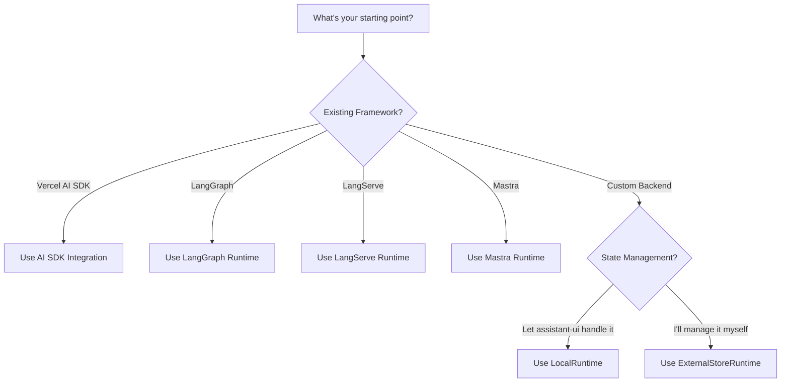

import { Card, Cards } from "fumadocs-ui/components/card";
import { Callout } from "fumadocs-ui/components/callout";

Choosing the right runtime is crucial for your assistant-ui implementation. This guide helps you navigate the options based on your specific needs.

## Quick Decision Tree



## Core Runtimes

These are the foundational runtimes that power assistant-ui:

<Cards>
  <Card
    title="`LocalRuntime`"
    description="assistant-ui manages chat state internally. Simple adapter pattern for any backend."
    href="/docs/runtimes/custom/local"
  />
  <Card
    title="`ExternalStoreRuntime`"
    description="You control the state. Perfect for Redux, Zustand, or existing state management."
    href="/docs/runtimes/custom/external-store"
  />
</Cards>

## Pre-Built Integrations

For popular frameworks, we provide ready-to-use integrations built on top of our core runtimes:

<Cards>
  <Card
    title="Vercel AI SDK"
    description="For useChat and useAssistant hooks - streaming with all major providers"
    href="/docs/runtimes/ai-sdk/use-chat"
  />
  <Card
    title="Data Stream Protocol"
    description="For custom backends using the data stream protocol standard"
    href="/docs/runtimes/data-stream"
  />
  <Card
    title="LangGraph"
    description="For complex agent workflows with LangChain's graph framework"
    href="/docs/runtimes/langgraph"
  />
  <Card
    title="LangServe"
    description="For LangChain applications deployed with LangServe"
    href="/docs/runtimes/langserve"
  />
  <Card
    title="Mastra"
    description="For workflow orchestration with Mastra's ecosystem"
    href="/docs/runtimes/mastra/overview"
  />
</Cards>

## Understanding Runtime Architecture

### How Pre-Built Integrations Work

The pre-built integrations (AI SDK, LangGraph, etc.) are **not separate runtime types**. They're convenient wrappers built on top of our core runtimes:

- **AI SDK Integration** → Built on `LocalRuntime` with streaming adapter
- **LangGraph Runtime** → Built on `LocalRuntime` with graph execution adapter
- **LangServe Runtime** → Built on `LocalRuntime` with LangServe client adapter
- **Mastra Runtime** → Built on `LocalRuntime` with workflow adapter

This means you get all the benefits of `LocalRuntime` (automatic state management, built-in features) with zero configuration for your specific framework.

### When to Use Pre-Built vs Core Runtimes

**Use a pre-built integration when:**
- You're already using that framework
- You want the fastest possible setup
- The integration covers your needs

**Use a core runtime when:**
- You have a custom backend
- You need features not exposed by the integration
- You want full control over the implementation

<Callout>
Pre-built integrations can always be replaced with a custom `LocalRuntime` or `ExternalStoreRuntime` implementation if you need more control later.
</Callout>

## Feature Comparison

### Core Runtime Capabilities

| Feature | `LocalRuntime` | `ExternalStoreRuntime` |
| ------- | -------------- | ---------------------- |
| **State Management** | Automatic | You control |
| **Setup Complexity** | Simple | Moderate |
| **Message Editing** | Built-in | Implement `onEdit` |
| **Branch Switching** | Built-in | Implement `setMessages` |
| **Regeneration** | Built-in | Implement `onReload` |
| **Cancellation** | Built-in | Implement `onCancel` |
| **Multi-thread** | Via adapters | Via adapters |

### Available Adapters

| Adapter | `LocalRuntime` | `ExternalStoreRuntime` |
| ------- | -------------- | ---------------------- |
| ChatModel | ✅ Required | ❌ N/A |
| Attachments | ✅ | ✅ |
| Speech | ✅ | ✅ |
| Feedback | ✅ | ✅ |
| History | ✅ | ❌ Use your state |
| Suggestions | ✅ | ❌ Use your state |

## Common Implementation Patterns

### Vercel AI SDK with Streaming

```tsx
import { useChatRuntime } from "@assistant-ui/react-ai-sdk";

export function MyAssistant() {
  const runtime = useChatRuntime({
    api: "/api/chat",
  });

  return (
    <AssistantRuntimeProvider runtime={runtime}>
      <Thread />
    </AssistantRuntimeProvider>
  );
}
```

### Custom Backend with `LocalRuntime`

```tsx
import { useLocalRuntime } from "@assistant-ui/react";

const runtime = useLocalRuntime({
  async run({ messages, abortSignal }) {
    const response = await fetch("/api/chat", {
      method: "POST",
      headers: { "Content-Type": "application/json" },
      body: JSON.stringify({ messages }),
      signal: abortSignal,
    });
    return response.json();
  },
});
```

### Redux Integration with `ExternalStoreRuntime`

```tsx
import { useExternalStoreRuntime } from "@assistant-ui/react";

const messages = useSelector(selectMessages);
const dispatch = useDispatch();

const runtime = useExternalStoreRuntime({
  messages,
  onNew: async (message) => {
    dispatch(addUserMessage(message));
    const response = await api.chat(message);
    dispatch(addAssistantMessage(response));
  },
  setMessages: (messages) => dispatch(setMessages(messages)),
  onEdit: async (message) => dispatch(editMessage(message)),
  onReload: async (parentId) => dispatch(reloadMessage(parentId)),
});
```

## Examples

Explore our implementation examples:

- **[AI SDK Example](https://github.com/assistant-ui/assistant-ui/tree/main/examples/with-ai-sdk)** - Vercel AI SDK with `useChatRuntime`
- **[External Store Example](https://github.com/assistant-ui/assistant-ui/tree/main/examples/with-external-store)** - `ExternalStoreRuntime` with custom state
- **[Assistant Cloud Example](https://github.com/assistant-ui/assistant-ui/tree/main/examples/with-cloud)** - Multi-thread with cloud persistence
- **[LangGraph Example](https://github.com/assistant-ui/assistant-ui/tree/main/examples/with-langgraph)** - Agent workflows
- **[OpenAI Assistants Example](https://github.com/assistant-ui/assistant-ui/tree/main/examples/with-openai-assistants)** - OpenAI Assistants API

## Common Pitfalls to Avoid

### LocalRuntime Pitfalls
- **Forgetting the adapter**: `LocalRuntime` requires a `ChatModelAdapter` - it won't work without one
- **Not handling errors**: Always handle API errors in your adapter's `run` function
- **Missing abort signal**: Pass `abortSignal` to your fetch calls for proper cancellation

### ExternalStoreRuntime Pitfalls
- **Mutating state**: Always create new arrays/objects when updating messages
- **Missing handlers**: Each UI feature requires its corresponding handler (e.g., no edit button without `onEdit`)
- **Forgetting optimistic updates**: Set `isRunning` to `true` for loading states

### General Pitfalls
- **Wrong integration level**: Don't use `LocalRuntime` if you already have Vercel AI SDK - use the AI SDK integration instead
- **Over-engineering**: Start with pre-built integrations before building custom solutions
- **Ignoring TypeScript**: The types will guide you to the correct implementation

## Next Steps

1. **Choose your runtime** based on the decision tree above
2. **Follow the specific guide**:
   - [AI SDK Integration](/docs/runtimes/ai-sdk/use-chat)
   - [`LocalRuntime` Guide](/docs/runtimes/custom/local)
   - [`ExternalStoreRuntime` Guide](/docs/runtimes/custom/external-store)
   - [LangGraph Integration](/docs/runtimes/langgraph)
3. **Start with an example** from our [examples repository](https://github.com/assistant-ui/assistant-ui/tree/main/examples)
4. **Add features progressively** using adapters
5. **Consider Assistant Cloud** for production persistence

<Callout type="info">
Need help? Join our [Discord community](https://discord.gg/S9dwgCNEFs) or check the [GitHub](https://github.com/assistant-ui/assistant-ui).
</Callout>
